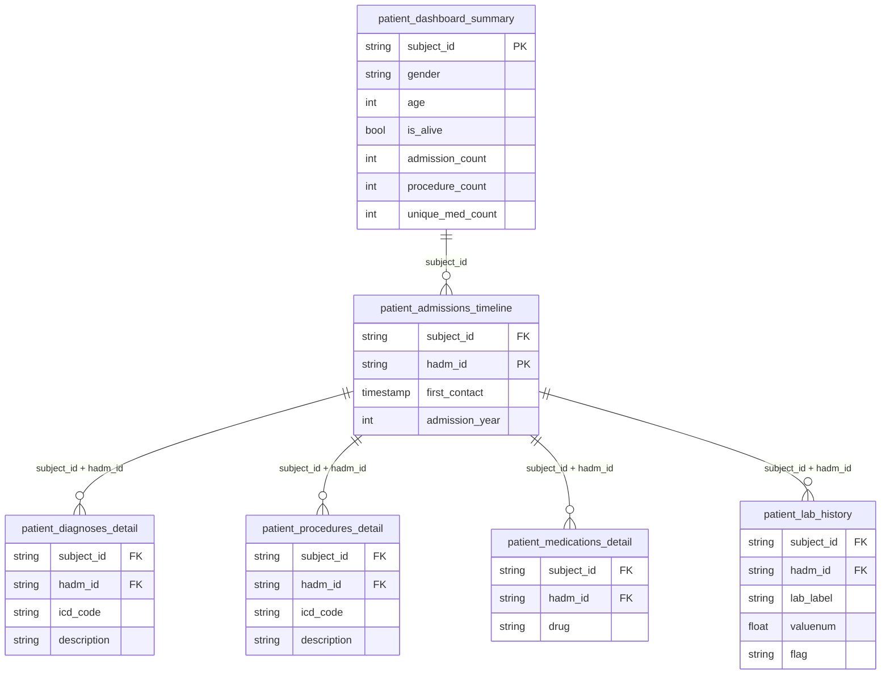

# Pipeline BigQuery Output Analysis & Looker Feasibility

## 1. What the Pipeline Outputs to BigQuery

Your pipeline writes **5 tables** to BigQuery under `cloudypedia-intern:hospital_profiling`:

| # | BigQuery Table | Description | Grain (1 row = ?) |
|---|---|---|---|
| 1 | `summary_stats` | Aggregate hospital-wide statistics | 1 row per pipeline run |
| 2 | `top_diagnoses` | Top 10 most frequent ICD codes | 1 row per ICD code (max 10) |
| 3 | `patient_dashboard_summary` | Patient-level summary card | **1 row per patient** |
| 4 | `patient_admissions_timeline` | Admission events per patient | 1 row per (patient, admission) |
| 5 | `patient_lab_history` | Detailed lab results | 1 row per lab result |

---

## 2. Correctness Assessment

### ✅ What's Working Well

- **Deduplication** of diagnoses and procedures is solid — uses `beam.Distinct()` on composite keys.
- **Dead-letter routing** — invalid rows are tagged `"invalid"` so they don't silently corrupt results.
- **CoGroupByKey** join for the patient dashboard is correct; it joins admissions, procedures, meds, and diagnoses by `subject_id`.
- **Lab history** correctly enriches raw lab events with the `d_labitems` lookup table.

### ⚠️ Potential Issues

| Issue | Table | Detail |
|---|---|---|
| **WRITE_TRUNCATE** on every run | All tables | Each pipeline run **replaces** all data. This is fine for batch refresh, but you lose history. Consider `WRITE_APPEND` + a `run_id` column if you need historical trends. |
| **Counts are aggregates, not detail** | `patient_dashboard_summary` | You get `admission_count = 5` but **not which admissions** (no `hadm_id` list). Same for procedures and meds — only counts. |
| **No procedure/med detail** in patient table | `patient_dashboard_summary` | You cannot see *which* procedures or *which* medications a patient had — only how many. |
| **No diagnosis codes** in patient table | `patient_dashboard_summary` | `unique_diagnosis_count` is there, but not the actual ICD codes or descriptions. |
| **Lab history has no procedure link** | `patient_lab_history` | Labs are linked to `hadm_id` but not to specific procedures. This is a MIMIC-IV data limitation. |

---

## 3. Can You Derive Patient-Level Info in Looker?

### What You Want vs. What's Currently Available

| You Want | Available in BQ? | Which Table? | Gap? |
|---|---|---|---|
| Patient's **number of admissions** | ✅ Yes | `patient_dashboard_summary.admission_count` | None |
| **Admission details** (each admission + code) | ⚠️ Partial | `patient_admissions_timeline` has `hadm_id` + `first_contact` | **No ICD codes per admission** — diagnoses aren't joined to admissions |
| Patient's **procedures** | ⚠️ Count only | `patient_dashboard_summary.procedure_count` | **No detail table** — you can't see *which* procedures |
| Patient's **medications** | ⚠️ Count only | `patient_dashboard_summary.unique_med_count` | **No detail table** — you can't see *which* drugs |
| **Labs + results** | ✅ Yes | `patient_lab_history` has `lab_label`, `valuenum`, `flag`, etc. | Fully detailed ✅ |
| Labs linked to an admission | ✅ Yes | `patient_lab_history.hadm_id` | Can join to `patient_admissions_timeline` |

### The Core Gap

> [!IMPORTANT]
> Your pipeline currently writes **aggregate counts** for procedures and medications to `patient_dashboard_summary`, but **no detail-level tables** for procedures or prescriptions. You cannot answer "What procedures did Patient X undergo during Admission Y?" from the current BigQuery output.

---

## 4. Recommended Additional Tables for Full Looker Support

To get everything you described, you'd need **3 more detail tables**:

### Table 1: `patient_procedures_detail`
```
subject_id | hadm_id | icd_code | icd_version | procedure_description
```
This lets you see each procedure per patient per admission.

### Table 2: `patient_medications_detail`
```
subject_id | hadm_id | drug | drug_normalized
```
This lets you see each medication prescribed per admission.

### Table 3: `patient_diagnoses_detail`
```
subject_id | hadm_id | icd_code | icd_version | diagnosis_description
```
This lets you see each diagnosis per admission.

> [!TIP]
> With these 3 tables plus your existing `patient_admissions_timeline` and `patient_lab_history`, you can build a **complete patient 360° dashboard** in Looker by joining everything on `subject_id` + `hadm_id`.

---

## 5. Looker Data Model (After Adding Detail Tables)



---

## 6. Summary

| Aspect | Verdict |
|---|---|
| Pipeline code correctness | ✅ **Correct** — good parsing, dedup, joins, and error handling |
| BigQuery output | ✅ **Working** — 5 tables load correctly |
| Patient admissions count | ✅ **Available** |
| Patient labs + results | ✅ **Available** (fully detailed) |
| Patient procedures detail | ❌ **Missing** — only count, no detail rows |
| Patient medications detail | ❌ **Missing** — only count, no detail rows |
| Patient diagnoses per admission | ❌ **Missing** — diagnoses not linked to `hadm_id` |

> [!CAUTION]
> **Bottom line:** Your pipeline is technically correct but incomplete for a full patient-level Looker dashboard. You need 3 additional detail tables (procedures, medications, diagnoses) to answer questions like "What procedures/meds/diagnoses did Patient X have during Admission Y?"

**Would you like me to add these 3 detail tables to the pipeline?**
